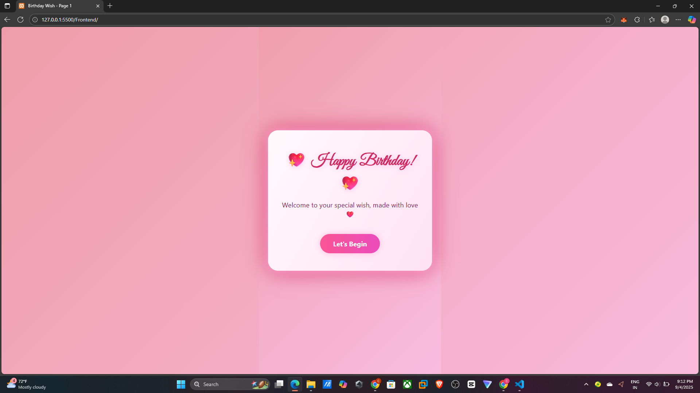
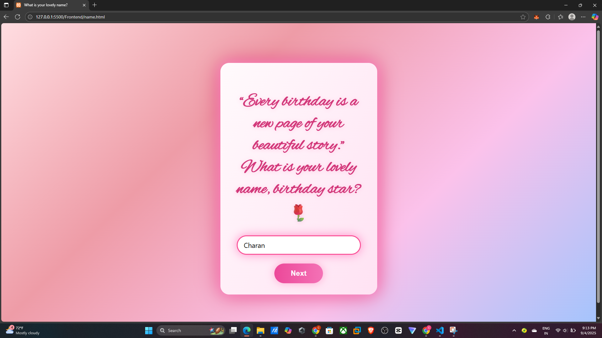
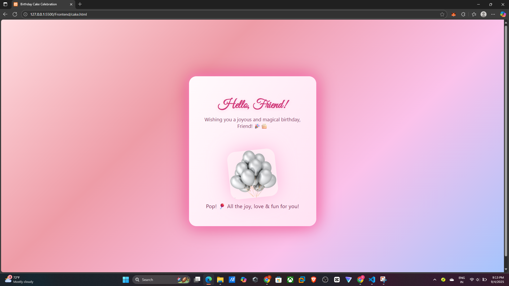
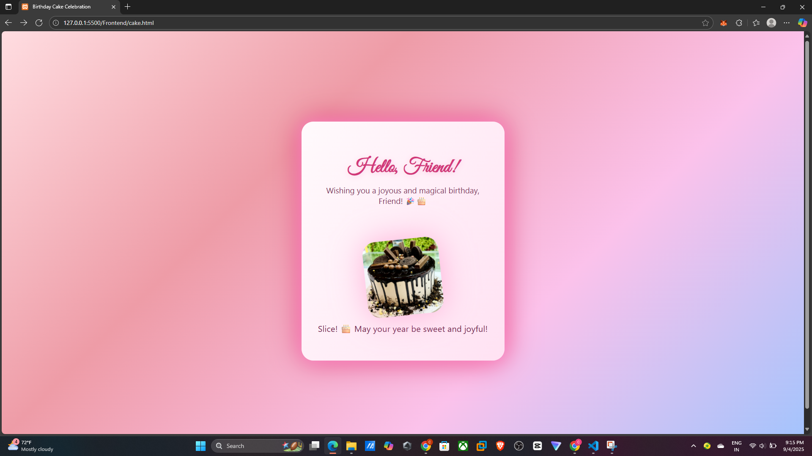
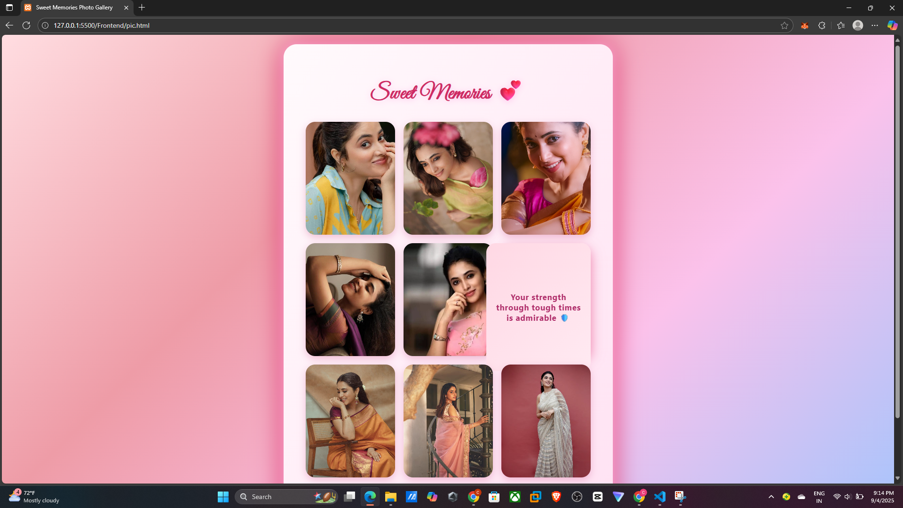
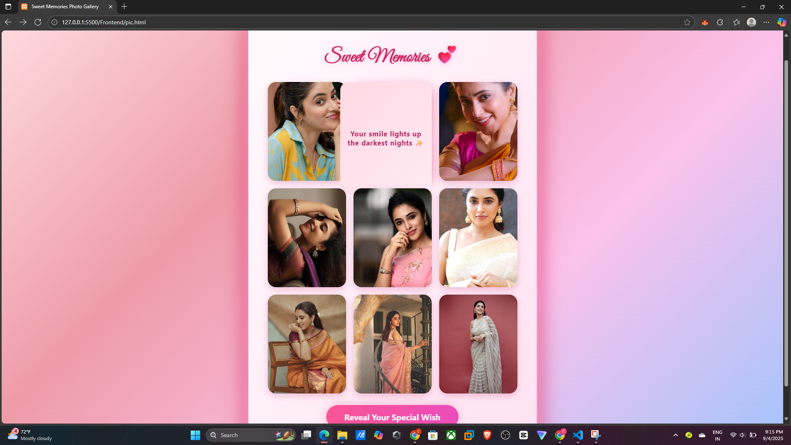
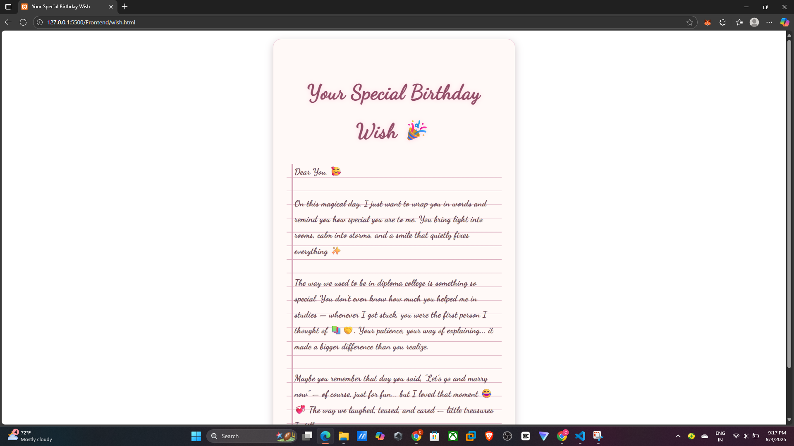

# 🎂 Birthday Wishes Project  

An interactive and fun **Birthday Wishes Website** built to surprise and celebrate special days 🎉.  
This project includes animations, colors, and creative effects to make birthdays memorable online!  

---

## ✨ Features
- 🎨 Colorful design with animations  
- 🎶 Option to add background birthday music  
- 🎈 Balloons, confetti, or fireworks effects  
- 📱 Mobile-friendly (responsive design)  
- 🎁 Surprise message/reveal button  

---

## 🚀 Live Demo
🔗 [Click here to view the website]([https://your-live-demo-link.com](https://cherry368.github.io/Birthday-Wishes-To-Friend/))  

---

## 📸 Preview
  
 
 
 
 
 
 

## 🛠️ How to Run Locally
1. Clone this repo:

 git clone https://github.com/cherry368/Birthday-Wishes-To-Friend.git
